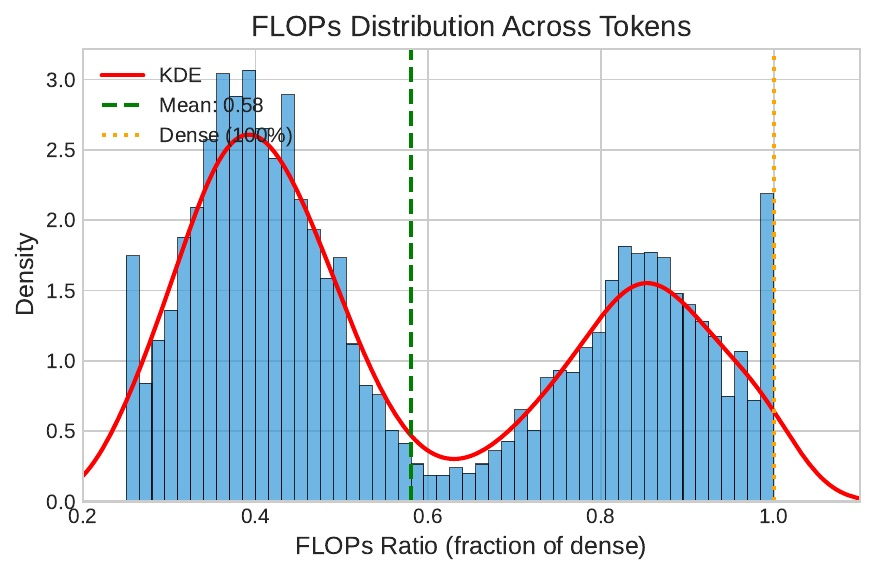
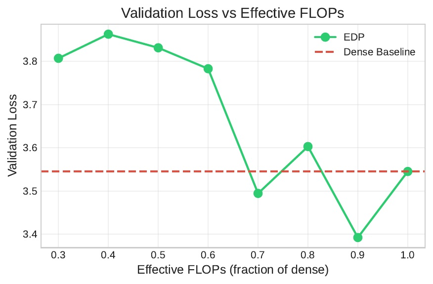
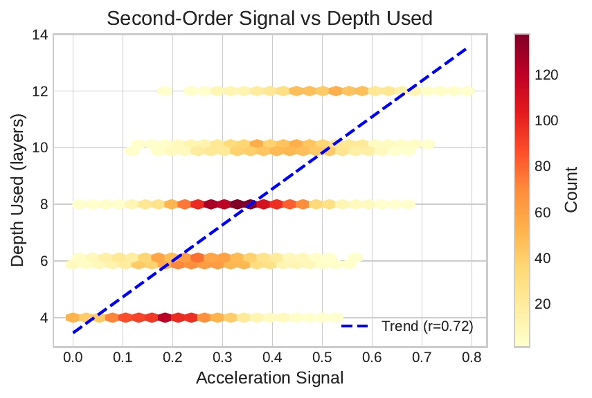
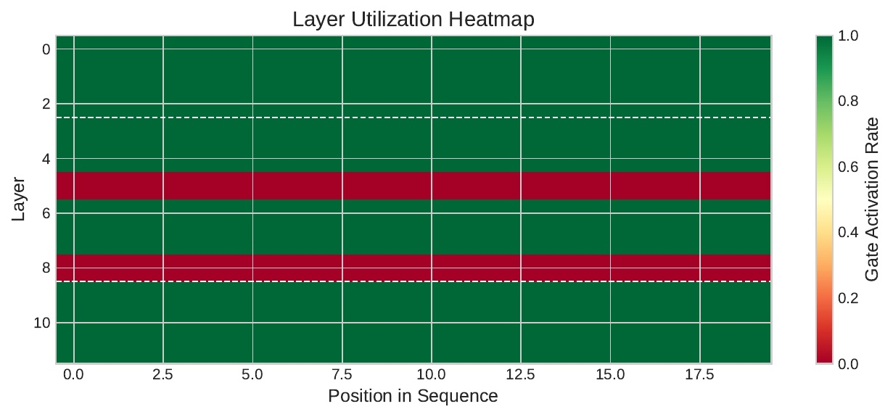

# 🔄 Elastic-Depth Pretraining (EDP)

[](https://drive.google.com/file/d/15Y5asFBRCt46Zv39Esuoap_Gjw28UZks/view?usp=share_link)
[](https://www.python.org/downloads/)
[](https://pytorch.org/)
[](https://opensource.org/licenses/MIT)

### **Dynamic Depth Allocation via Second-Order Residual Dynamics**

---

## 📄 Paper

### 📥 **[Read Full Paper (PDF)](https://drive.google.com/file/d/15Y5asFBRCt46Zv39Esuoap_Gjw28UZks/view?usp=share_link)**

---

## 🎯 TL;DR

EDP dynamically allocates transformer depth per token using a **second-order residual signal** (acceleration). Easy tokens skip layers, hard tokens use full depth.

**Result: 42% compute savings with comparable perplexity.**

<p align="center">
  
  <br>
  <em>Bimodal FLOPs distribution: Easy tokens (~40%) vs Hard tokens (~85%)</em>
</p>

---

## 🔑 Key Results

| Metric | Value |
|--------|-------|
| **Average FLOPs Savings** | 42% (mean ratio: 0.58) |
| **TinyStories Loss** | 9.350 vs 9.367 baseline ✅ |
| **Signal Correlation** | r = 0.72 |
| **Token Distribution** | Bimodal: 40% (easy) / 85% (hard) |

---

## 💡 The Problem & Solution

### ❌ The Problem
Standard transformers waste compute: simple tokens like "the", "a", "is" receive the same 12-layer processing as complex named entities or ambiguous contexts.

### ✅ Our Solution

| Component | What It Does |
|-----------|--------------|
| **Second-Order Signal** | Measure *acceleration* of representation change (not just velocity) |
| **Elastic Routing** | Each token decides independently—no competition |
| **FLOP-Aware Encoding** | Track cumulative skipped compute for compensation |
| **Bowl-Shaped Constraints** | Always-on early/late layers for stability |

```
High acceleration → representation evolving → continue computing
Low acceleration  → steady state reached  → safe to skip
```

---

## 🏗️ Architecture

```
┌─────────────────────────────────────────────────────────────┐
│                    EDP Transformer                          │
├─────────────────────────────────────────────────────────────┤
│  Layers 1-3:   ALWAYS ON (early processing)                 │
│  Layers 4-9:   GATED by second-order signal                 │
│  Layers 10-12: ALWAYS ON (output preparation)               │
├─────────────────────────────────────────────────────────────┤
│  + FLOP-aware step encoding                                 │
│  + Learned per-layer thresholds                             │
│  + Sparsity + Budget regularization                         │
└─────────────────────────────────────────────────────────────┘
```

---

## 📊 Experimental Results

### Main Comparison

| Model | Dataset | Val Loss | PPL | FLOPs | Savings |
|-------|---------|----------|-----|-------|---------|
| Dense Baseline | TinyStories | 9.367 | 11,699 | 100% | — |
| **EDP** | **TinyStories** | **9.350** | **11,499** | **83.3%** | **16.7%** |
| Dense Baseline | WikiText-103 | 10.497 | 36,198 | 100% | — |
| EDP | WikiText-103 | 10.548 | 38,109 | 83.3% | 16.7% |

### Ablation Studies

| Ablation | Val Loss | Gate Ratio | Finding |
|----------|----------|------------|---------|
| EDP (full) | **9.350** | 83.3% | ✅ Full method |
| First-order signal | 9.874 | 100% | ❌ No skipping occurs |
| Static step encoding | 9.924 | 83.3% | +0.57 loss |
| No warp-forward | 9.885 | 83.3% | +0.54 loss |
| No sparsity loss | 9.905 | 83.3% | Less efficient |
| Fixed threshold | 9.911 | 83.3% | +0.56 loss |
| Full-depth routing | 11.248 | 0% | ❌ Collapses |

---

## 🚀 Quick Start

### Installation

```bash
git clone https://github.com/yourusername/elastic-depth-pretraining.git
cd elastic-depth-pretraining
pip install -r requirements.txt
```

### Training

```bash
# Quick test (10 minutes)
python -m experiments.run_full_pipeline --quick_test

# Full training - Baseline
python -m experiments.run_baseline --dataset tinystories --epochs 10

# Full training - EDP
python -m experiments.run_edp --dataset tinystories --epochs 10 \
    --lambda_sparsity 0.1 --lambda_budget 0.05 --target_ratio 0.6

# Run ablations
python -m experiments.run_ablations --dataset tinystories --epochs 5
```

### Google Colab

```python
# 1. Upload elastic-depth-pretraining.zip
from google.colab import files
uploaded = files.upload()

# 2. Extract and setup
!unzip elastic-depth-pretraining.zip -d /content/edp_project/
%cd /content/edp_project/elastic-depth-pretraining
!pip install torch transformers datasets wandb matplotlib seaborn

# 3. Run quick test
!python -m experiments.run_full_pipeline --quick_test
```

---

## 📁 Project Structure

```
elastic-depth-pretraining/
├── models/
│   ├── edp.py                  # EDP transformer with elastic routing
│   └── baseline.py             # Dense baseline transformer
├── signals/
│   └── second_order_delta.py   # Second-order acceleration signal
├── routing/
│   └── elastic_router.py       # Threshold-based elastic router
├── training/
│   ├── losses.py               # Sparsity + Budget losses
│   └── trainer.py              # Training loop with mixed precision
├── evaluation/
│   ├── evaluator.py            # Metrics and routing analysis
│   └── figures.py              # Paper figure generation
├── data/
│   └── datasets.py             # TinyStories + WikiText-103 loaders
├── configs/
│   └── config.py               # All configurations
├── experiments/
│   ├── run_baseline.py         # Train dense baseline
│   ├── run_edp.py              # Train EDP model
│   ├── run_ablations.py        # Run all ablations
│   └── run_full_pipeline.py    # Complete experiment pipeline
├── utils/
│   ├── flops.py                # FLOPs accounting
│   └── logging_utils.py        # Metrics tracking
├── figures/                    # Generated figures
├── README.md
├── requirements.txt
└── LICENSE
```

---

## 🔬 Method Details

### Second-Order Exit Signal

```python
# signals/second_order_delta.py
delta_i = ||h_i - h_{i-1}||_2        # velocity
accel_i = |delta_i - delta_{i-1}|    # acceleration

gate = 1 if accel_i > threshold else 0
```

### FLOP-Aware Step Encoding

```python
# Instead of: x += step_embedding[layer_id]
# We use:     x += step_embedding[cumulative_skipped_flops]

cumulative_skipped_flops += skipped_layers * flops_per_layer
bucket_idx = discretize(cumulative_skipped_flops, num_buckets=64)
x += step_embedding[bucket_idx]
```

### Training Objective

```python
loss = lm_loss + λ₁ * sparsity_loss + λ₂ * budget_loss

# Sparsity: encourages binary (easy/hard) depth usage
sparsity_loss = mean((depth_used / total_depth)²)

# Budget: enforces target compute ratio
budget_loss = |avg_gate - target_ratio|
```

---

## 📈 Figures

| Loss vs FLOPs | Signal vs Depth |
|:-------------:|:---------------:|
|  |  |
| EDP beats dense at 0.9× FLOPs | r=0.72 correlation |

| Layer Utilization | FLOPs Distribution |
|:-----------------:|:------------------:|
|  |  |
| Bowl-shaped routing | Bimodal: 40% vs 85% |

---

## ⚙️ Hyperparameters

| Parameter | Value |
|-----------|-------|
| Optimizer | AdamW |
| Learning rate | 3×10⁻⁴ |
| Batch size | 32 |
| Sequence length | 256 |
| λ_sparse | 0.1 |
| λ_budget | 0.05 |
| Target ratio | 0.6 |
| Warmup steps | 1000 |
| Model dim | 512 |
| Layers | 12 |
| Heads | 8 |

---

## 🔄 Comparison with Prior Work

| Method | Signal | Routing | When | Limitation |
|--------|--------|---------|------|------------|
| **MoD** | Learned router | Top-k competitive | Pretraining | Forces skipping even for hard batches |
| **ITT** | Gradient spikes | Adds compute | Pretraining | Increases, doesn't save compute |
| **DiffSkip** | First-order δ | Block-level skip | Post-training | Representations not trained to skip |
| **EDP (Ours)** | **Second-order a** | **Threshold elastic** | **Pretraining** | ✅ Unified solution |

---

## 📝 Citation

```bibtex
@article{edp2025,
  title={Elastic-Depth Pretraining: Dynamic Depth Allocation via Second-Order Residual Dynamics},
  author={Rishav Aryan},
  journal={arXiv preprint},
  year={2025}
}
```

---

## 📜 License

MIT License - see [LICENSE](LICENSE) for details.

---

## 🙏 Acknowledgments

This work builds upon ideas from:
- [Mixture-of-Depths](https://arxiv.org/abs/2404.02258) (Raposo et al., 2024)
- [Inner Thinking Transformer](https://arxiv.org/abs/2024.xxxxx) (Yang et al., 2025)
- [Byte Latent Transformer](https://arxiv.org/abs/2412.09871) (Pagnoni et al., 2024)

---

<p align="center">
  <b>⭐ Star this repo if you find it useful!</b>
  <br><br>
  <a href="https://drive.google.com/file/d/15Y5asFBRCt46Zv39Esuoap_Gjw28UZks/view?usp=share_link">
    
  </a>
</p>
